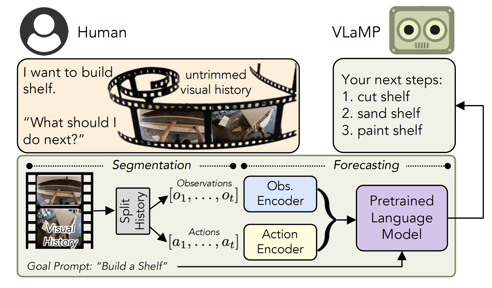

# Pretrained Language Models as Visual Planners for Human Assistance

******************************************************


This repo has the implementation of our paper: [Pretrained Language Models as Visual Planners for Human Assistance](https://arxiv.org/abs/2304.09179)





# Setting up the repository

1. Create the virtual environment and activate

```
conda create --file env.yaml -p .venv_vlamp python==3.9.7 
```

Note: If the installer complains about missing rust compiler while installing tokenizers. Install it using this [link](https://www.rust-lang.org/tools/install).

Note: If you get missing `pkg-config` error on M1, install using the following and see [this](https://github.com/google/sentencepiece/issues/378) issue for more info.

```
brew install cmake
brew install pkg-config
```

```
conda activate ./.venv_vlamp
```

2. Install the editable version

```
pip install -e .
```


# Getting the data

## Crosstask

Please follow the [instructions](https://github.com/DmZhukov/CrossTask#code) in the official crosstask repository to download crosstask annotations into `.data/crosstask`

Once downloaded, you should see the following directory structure in the dataset directory:


```
.data
    |- crosstask
        |- annotations
        |- 
        |-
        ...
        |- task_primary.txt
        |- task_related.txt
        |- videos.csv
        |- videos_val.csv
```

`task_primary.txt` has a list of 18 primary tasks where each task is listed using a *task card* in the following format with an empty line between tasks:

```
Task ID
Task name
URL of corresponding WikiHow page
Number of steps
Ordered list of comma-separated steps of the task
```

Following are the first few lines from `task_primary.txt`:

```
23521
Make Jello Shots
http://www.wikihow.com/Make-Jello-Shots
6
pour water,pour juice,pour jello powder,pour alcohol,stir mixture,pour mixture into cup

59684
Build Simple Floating Shelves
http://www.wikihow.com/Build-Simple-Floating-Shelves
5
cut shelve,assemble shelve,sand shelve,paint shelve,attach shelve
```

Note that each step will get a unique step id in the context of the task based on its position in the last line of the *task card*.

We use the primary tasks for our work.

The `videos.csv` contains link for videos in the format `<Task ID>,<YouTube video ID>,<URL>` per line.

The `annotations` folder contains one file per video named as `<task id>_<video id>.csv`. Each file contains one step per line in the following format, `<number of step>,<start in seconds>,<end in seconds>`, where `<number of step>` is the id of the step in the `task_primary.txt`.  For example, following are the contents of `annotations/113766__uAZw6L_R5g.csv`.

```
1,33.54,39.94
2,53.47,56.07
6,71.82,75.46
6,83.06,85.62
8,90.34,93.06
10,96.31,100.67
```

### Downloading the videos

Clone `https://github.com/dhruvdcoder/crosstask_video_downloader` into a separate folder and use `python main.py --dataset_root data/crosstask --n_workers 10 --download_dir data/crosstask/videos` to download videos in a directory named `videos` in the `crosstask` data directory.

### Extracting S3D features

Clone `https://github.com/dhruvdcoder/VideoFeatureExtractor` in a separate folder and follow the instructions therein to create S3D features.

### Performing video action segmentation using VideoCLIP

We use the official implementation of [VideoCLIP](https://github.com/dhruvdcoder/fairseq/tree/main/examples/MMPT) to perform video action segmentation. Note that our model omits the last FC layer (1024->512) of S3D model while VidoeCLIP retains this layer. So S3D feature size for input to our model should be 1024 but for VideoCLIP it is 512.

Clone `https://github.com/dhruvdcoder/fairseq` in a separate directory. Go to the folder `examples/MMPT` and follow the instructions there to install VideoCLIP and to preprocess crosstask dataset.

Once setup execute the following to create 512-dimensional S3D features for the VideoCLIP model.

```
python scripts/video_feature_extractor/extract.py --vdir <path_to_data>/crosstask/videos --fdir <path_to_data>/crosstask/s3dg_features_vidoeclip --type=s3d --num_decoding_thread=20 --batch_size 32 --half_precision 1
```

Modify `projects/retri/videoclip/crosstask_videoclip_seg_new_split.yaml` to point to the `<path_to_data>` as shown below:

```
train_path: <path_to_data>/crosstask/videos.csv
train_csv_path: <path_to_data>/crosstask/videos.csv
val_path: <path_to_data>/crosstask/videos_val.csv
val_csv_path: <path_to_data>/crosstask/videos_val.csv
primary_path: <path_to_data>/crosstask/tasks_primary.txt
related_path: <path_to_data>/crosstask/tasks_related.txt
vfeat_dir: <path_to_data>/crosstask/s3dg_features_videoclip
annotation_path: <path_to_data>/crosstask/annotations
```

To finetune on crosstask execute the following:

```
python locallaunch.py projects/retri/videoclip/crosstask_videoclip_seg_new_split.yaml --jobtype local_small
```

To perform prediction using the finetuned model execute the following:

```
python locallaunch.py projects/retri/videoclip/test_crosstask_videoclip_seg_new_split.yaml --jobtype local_predict
```

Finally, move the `preds.json` file into `<path_to_data>/crosstask/videoclip_preds.json` to use with VLaMP. 


## COIN

The annotations can be downloaded from `https://github.com/coin-dataset/annotations/raw/master/COIN.json`.

Download the splits used in our work using the following: 

TODO

Follow the same procedure as done for crosstask to obtain S3D features and VideoCLIP segmentation results for COIN.


# Training VLaMP

```
CUDA_DEVICE=0 seed=123 allennlp train best_model_configs_no_wandb/p3lm-GT.jsonnet -s <path to dir where model should be saved> --include-package vlamp
```

Download pretrained models:

| Dataset   	| Model id 	| drive id                          	|
|-----------	|----------	|-----------------------------------	|
| Crosstask 	| yyaqgtoq 	| 1AxJYiayjUTfWC_LEITKcBDYXcn39Pe54 	|
| Crosstask 	| 9t05mx8h 	| 1ubyOF_DDzqmPMqkPxrljudZCo7NjZn5w 	|
| Crosstask 	| c0eovx5i 	| 1njBlBn-hZmq7TP6nk5IW2BtIg4i6U7Jk 	|
| Crosstask 	| e0mu18l3 	| 17vi89l0hYPyq0C0kPq-xtAc1aU7qv7aY 	|
| Crosstask 	| 10yxgxr1 	| 1oCNW5Fw_mxieHZPAQuAcommitrUGhhsN 	|
| COIN      	| p1z5i1xe 	| 16oku7zwPyKhC6vfo5hmE61EseCQsiUFZ 	|
| COIN      	| 7cq1owwq 	| 1gBBipLfTqSKwDTNfBurC_9vBqebcBLGj 	|
| COIN      	| h1lgoxdm 	| 1WzLe33pxwtwNUV-sgFxS-Yx1KPaZKu0l 	|
| COIN      	| s71nb0kl 	| 1XW4h_qCTRDRZXgP4_01UHFK1o4HFs35P 	|
| COIN      	| pi1vd8h6 	| 1YZc0CbwEJGz9PMRj3a7YoWS50qis2Xn1 	|


Download each model by opening `https://drive.google.com/drive/u/2/folders/18HY0QhP4_FEKSql6LqOhydUbCa_34h_X` and then unzip each model into separate directory. 


# Running the eval

To run eval on a model run `evaluate_coin.sh` and `evaluate_crosstask.sh` with appropriate model path.


# License

The majority of VLaMP is licensed under CC-BY-NC, however, portions of the projects are available under separate license terms:HuggingFace Transformers are licensed under the Apache2.0 license; S3D and COIN are licensed under the MIT license; CrossTask is licensed under the BSD-3.

